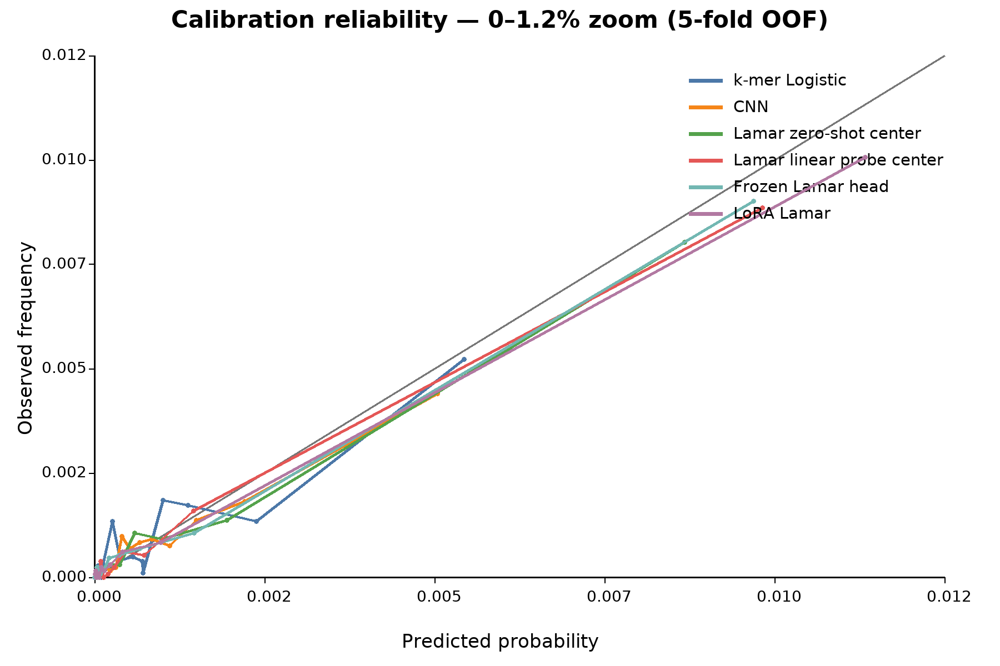

# Model engineering

## Baselines first

We trained two sequence-only baselines:

- logistic regression on 1- to 4-mer counts, GC fraction, C count, and
  sequence entropy;
- a one-hot 101-nt convolutional neural network.

These baselines test whether a foundation model adds information beyond simple
motif and composition shortcuts.

## LAMAR adaptation strategies

We compared:

- a frozen LAMAR backbone with trainable classification heads;
- partial fine-tuning of the last 1, 2, or 4 transformer blocks;
- LoRA on attention projections with multiple ranks and dropout values;
- full fine-tuning as a resource-intensive upper-bound experiment.

Negative sampling ratios from 1:1 through 1:20, random/matched/hard mixtures,
BCE variants, focal loss, learning rates, weight decay, warmup, and batch size
were evaluated in stages. Only dev AP selected configurations.

The final configuration used:

- center-token pooling;
- q/k/v/o LoRA, rank 4, alpha 8, dropout 0.05;
- BCE;
- dynamic random strict negatives at 1:10;
- backbone learning rate `1e-5`, head learning rate `1e-4`;
- batch size 16 with two-step gradient accumulation;
- warmup 0.03, no weight decay;
- early stopping with patience 3.

## Probability calibration

Training class ratios are not real-world probabilities. We compared raw
scores, Platt scaling, and isotonic regression using only the fixed 1:1000
calibration split. The selected Platt-calibrated threshold was
`0.24298369973628076`, maximizing recall subject to at most 100 false
positives per million calibration negatives.

## Pretrained-representation ablation

To ask whether pretraining itself encoded useful information, the original
checkpoint was loaded without LoRA, fine-tuned weights, or a task head. All
85,851,793 backbone parameters were frozen.

We compared center, mean, masked-mean, and CLS representations using:

- labeled train centroids with cosine, Euclidean, or diagonal-Mahalanobis
  scoring and no gradient-based adaptation;
- logistic linear probes with only 769 trained parameters.

“Zero-shot” here means zero gradient-based LAMAR adaptation. It is not
label-free because train labels estimate the centroids.
