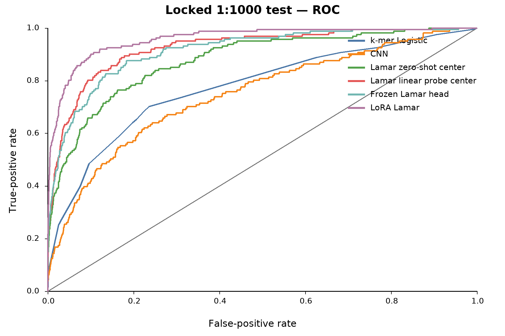

# Results and ablation

## Locked 1:1000 test

All model choices, calibration functions, and thresholds were frozen before
the locked test was opened.

| Model | Trained parameters | Dev AP | Test AP | Precision | Recall | FP/M |
| --- | ---: | ---: | ---: | ---: | ---: | ---: |
| LoRA LAMAR | 297,217 | 0.825438 | 0.171958 | 0.476190 | 0.124224 | 136.646 |
| Partial LAMAR, 2 blocks | 14,179,585 | 0.775930 | 0.103259 | 0.391304 | 0.055901 | 86.957 |
| Full fine-tuning | 85,854,098 | 0.799066 | 0.096254 | 0.400000 | 0.062112 | 93.168 |
| Linear probe, center | 769 | 0.698583 | 0.066262 | 0.333333 | 0.024845 | 49.689 |
| Frozen LAMAR head | 2,305 | 0.686136 | 0.064390 | 0.285714 | 0.049689 | 124.224 |
| Zero-gradient center centroid | 0 | 0.591302 | 0.036180 | 0.066667 | 0.006211 | 86.957 |
| CNN | 59,969 | 0.365052 | 0.013912 | 0.111111 | 0.012422 | 99.379 |
| k-mer logistic | 344 | 0.330512 | 0.006598 | 0 | 0 | 0 |

## What did pretraining contribute?

The task-unadapted center representation exceeded both simple baselines.
Adding a linear probe increased test AP from 0.036180 to 0.066262. The frozen
neural head reached a similar 0.064390. LoRA then increased AP by another
0.105695 over the linear probe.

This pattern supports two conclusions:

1. pretraining already encodes task-relevant sequence structure;
2. task-specific representation adaptation contributes substantially beyond
   a simple classifier.

Center pooling was essential. Mean-pooling test AP was 0.004307 for centroid
scoring and 0.005391 for the linear probe.

## Operational interpretation

At the frozen threshold, LoRA returned 42 predicted positives from the locked
test:

- 20 computational true positives;
- 22 computational false positives;
- precision 47.6%;
- recall 12.4%.

The calibration set met 96.97 FP/M, while the unchanged threshold reached
136.65 FP/M on test. We did not tighten the threshold using test outcomes,
because that would convert the locked test into a development set.

## Shortcut and error analysis

The metadata-only dev model reached AP 0.759266, embedding-only reached
0.698583, and their combination reached 0.813666. PC3 correlated with GC
fraction at `r=0.637`. Sequence-only input prevents direct use of coverage,
but sequence composition and dataset-generation bias remain plausible.

At the strict operating point, about half of zero-shot and linear-probe false
negatives were low-efficiency computational positives. Among the top 100
highest-scoring strict negatives, motif-similar negatives accounted for 81
zero-shot cases and 99 linear-probe cases, identifying a key hard-negative
failure mode.
