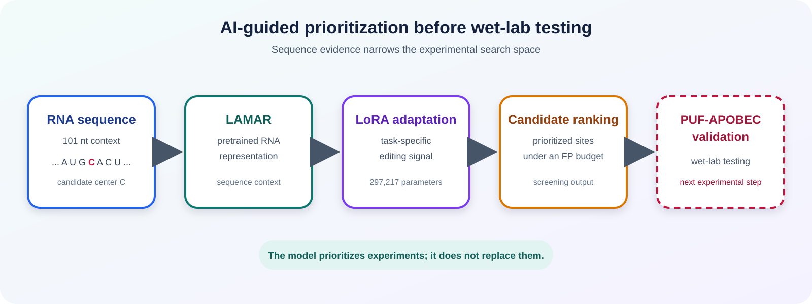
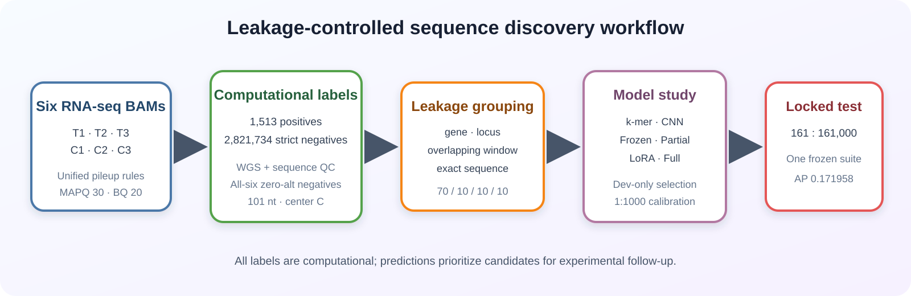
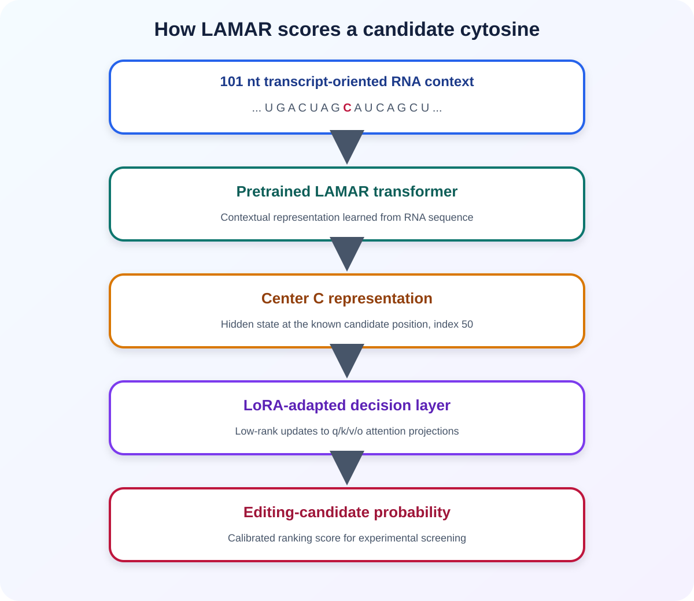
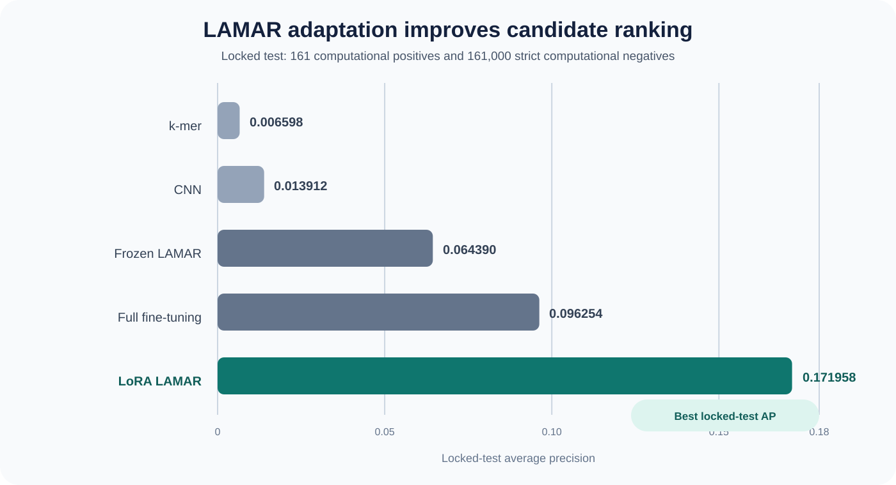
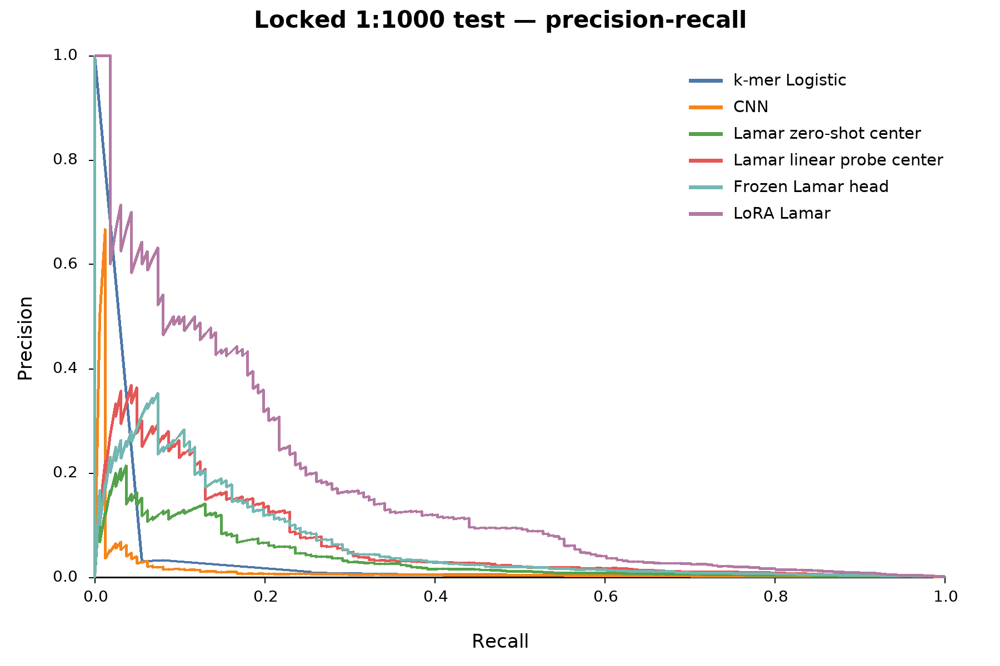
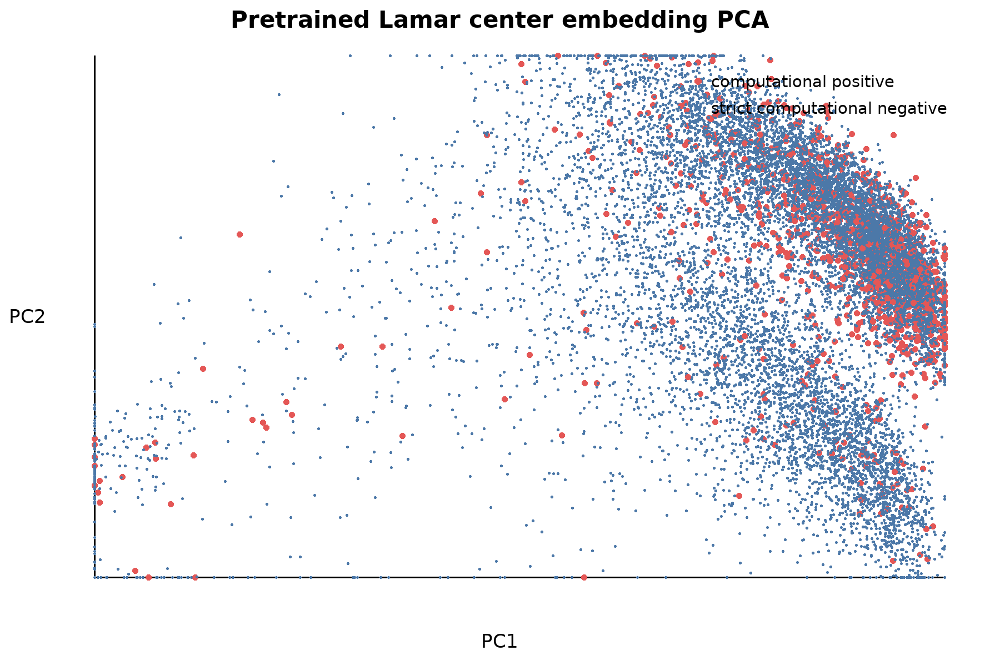
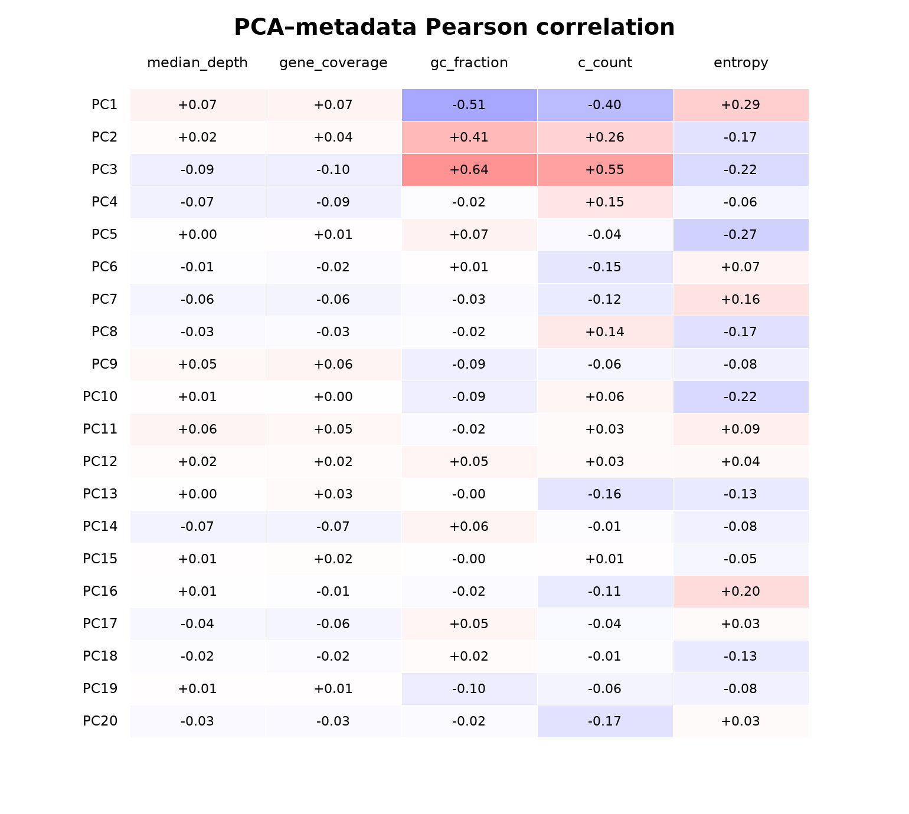
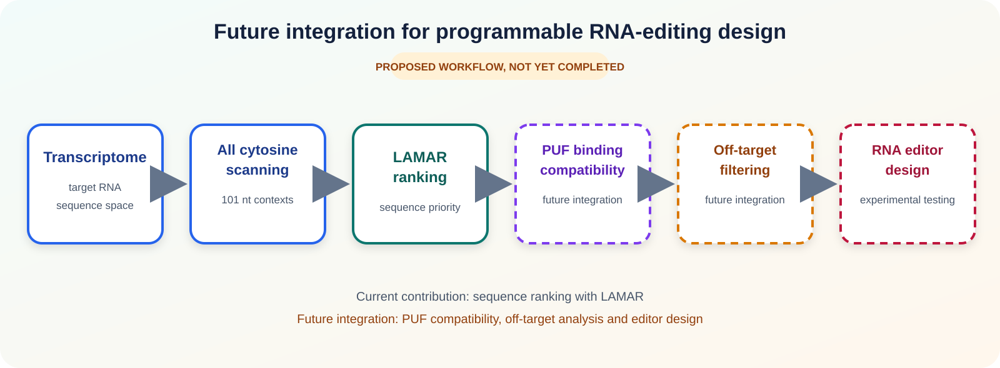

# AI-guided RNA editing design with LAMAR

> **Prioritizing candidate RNA sites for programmable C-to-U editing using
> pretrained RNA language models.**

Experimental validation cannot test every cytosine in the transcriptome. Our
model ranks candidate editing contexts before wet-lab validation.

This dry-lab project evaluates one decision layer in programmable RNA editing:
choosing which sequence contexts should move forward to PUF-APOBEC experiments.
The output is a ranked shortlist, not experimental proof of editing.

## 1. Biological motivation

> **Takeaway:** Programmable RNA editors need computational guidance because
> the number of possible target cytosines is much larger than experimental
> capacity.

APOBEC cytidine deaminase activity can support C-to-U conversion in engineered
RNA-editing systems. PUF repeat proteins offer programmable RNA recognition.
These components motivate a PUF-APOBEC strategy for targeted RNA editing.

The unresolved design question is where to edit. Each transcript can contain
many cytosines, and local sequence contexts differ. Testing every possible site
would consume substantial cloning, sequencing and validation effort.

We use AI to prioritize candidates before wet-lab testing:

`Thousands of cytosines` → `sequence screening` → `LAMAR ranking` →
`prioritized candidates` → `PUF-APOBEC testing`

The model does not select a complete editor design. It provides sequence
evidence that can be combined with PUF-binding and off-target criteria.

## 2. Computational strategy

> **Takeaway:** The workflow turns RNA-seq evidence into leakage-controlled
> labels, then learns a sequence ranking for experimental follow-up.

The system has three stages:

1. **Dataset:** recount six RNA-seq samples and construct computational labels.
2. **Model:** adapt pretrained LAMAR to recognize editing-associated contexts.
3. **Prediction:** rank 101-nt sequences around candidate cytosines.

Every model input is transcript oriented and exactly 101 nt long. The candidate
C is placed at zero-based index 50.

| Input | AI role | Output |
| --- | --- | --- |
| A 101-nt context centered on C | Compare the context with learned editing-associated sequence patterns | A calibrated candidate-ranking probability |

The model receives sequence only. Coverage and annotation are used for dataset
construction, matching and audits, not as default model inputs.

## 3. Dataset construction

> **Takeaway:** Strict labels require direct six-sample measurement, and
> related sequences never cross evaluation boundaries.

### Unified RNA-seq recounting

Three treated and three control MarkDuplicates BAMs were analyzed with one
pileup implementation:

- mapping quality of at least 30;
- base quality of at least 20;
- exclusion of unmapped, secondary, QC-failed, duplicate-flagged and
  supplementary reads;
- one count for overlapping paired-end observations;
- usable depth defined as filtered A+C+G+T depth;
- a minimum qualifying usable depth of 20.

Positive-strand C-to-T and negative-strand G-to-A events were normalized to the
same transcript-oriented C-to-U representation.

### Computational-positive class

All sites began with a broad 9,930-site candidate matrix, but their counts were
recomputed from the six selected BAMs. Corrected editing efficiency was:

`max(treated_median - control_median, 0)`.

A main computational positive required:

1. corrected editing efficiency strictly greater than 0.10;
2. at least two depth-qualified treated and control replicates;
3. a control median no greater than 0.02;
4. a valid 101-nt context centered on C;
5. no central variant in either whole-genome sequencing VCF;
6. deterministic genomic-key deduplication.

The dataset contained **1,513 main computational positives**. A
high-confidence subset imposed all-six coverage, BH-FDR and replicate
variability criteria. It retained **1,457 sites**.

The Fisher and Benjamini-Hochberg values are pooled-read screening statistics.
They are not biological-replicate experimental validation.

### Expression-supported strict negatives

An unreported site is not automatically negative. Every strict computational
negative required:

- usable depth of at least 20 in all six samples;
- exactly zero target-alternative reads in all six samples;
- no overlap with a positive or broad ambiguous candidate center;
- no central variant in either whole-genome sequencing VCF;
- valid orientation, reference base and 101-nt sequence;
- no low-complexity trigger.

These rules yielded **2,821,734 strict computational negatives**. The all-six
coverage and zero-alt assertion had zero violations.

The same low-complexity OR rule was applied to both classes before splitting:

- base-2 nucleotide entropy below 1.20;
- a homopolymer run of at least 20 nt;
- dinucleotide-repeat coverage of at least 0.80.

No main computational positive was removed. The rule excluded 2,087 of
2,823,821 potential strict negatives, or 0.0739%.

External basewise mappability was unavailable and is recorded as
`NA_RESOURCE_MISSING`. Sequence-complexity and mapping-quality filters are not
treated as external mappability validation.

### Leakage control

Sites shared a leakage group when they shared a gene, genomic center, exact
sequence or overlapping strand-aware 101-nt window. Group assignment occurred
before sampling.

| Split | Positives | Evaluation negatives | Purpose |
| --- | ---: | ---: | --- |
| Train | 1,028 | Dynamic train-only pool | Parameter learning |
| Development | 159 | 1,590 | Model selection |
| Calibration | 165 | 165,000 | Calibration and threshold selection |
| Locked test | 161 | 161,000 | One final evaluation |

No gene, leakage group, exact sequence or genomic key crossed splits. The
locked test was not used for model selection, hard-negative mining,
calibration or threshold choice.

## 4. AI model

> **Takeaway:** LAMAR represents RNA context, while LoRA efficiently adapts
> attention to the editing-prioritization task.

LAMAR is a pretrained RNA language model. For each candidate, it produces
contextual hidden representations across the 101-nt sequence.

The selected model uses the representation at the known center C. Low-rank
adaptation then updates q/k/v/o attention projections without retraining the
entire backbone.

The final configuration used:

- center-token pooling;
- q/k/v/o LoRA with rank 4, alpha 8 and dropout 0.05;
- binary cross-entropy;
- dynamic random strict negatives at 1:10;
- backbone and head learning rates of `1e-5` and `1e-4`;
- batch size 16 with two-step gradient accumulation;
- warmup ratio 0.03, no weight decay and early stopping.

The configuration was selected using development AP and repeated with seeds
42, 43 and 44. Development AP was `0.808719 ± 0.013597`.

We also evaluated k-mer logistic regression, a convolutional neural network,
frozen LAMAR, partial fine-tuning and full fine-tuning. These comparisons test
whether pretrained sequence information and task adaptation add value.

## 5. Performance evaluation

> **Takeaway:** LoRA LAMAR achieved the strongest locked-test AP, while the
> frozen threshold preserved an explicit false-positive budget.

| Model | Trained parameters | Development AP | Test AP | Precision | Recall | FP/M |
| --- | ---: | ---: | ---: | ---: | ---: | ---: |
| LoRA LAMAR | 297,217 | 0.825438 | 0.171958 | 0.476190 | 0.124224 | 136.646 |
| Partial LAMAR, two blocks | 14,179,585 | 0.775930 | 0.103259 | 0.391304 | 0.055901 | 86.957 |
| Full LAMAR fine-tuning | 85,854,098 | 0.799066 | 0.096254 | 0.400000 | 0.062112 | 93.168 |
| LAMAR center linear probe | 769 | 0.698583 | 0.066262 | 0.333333 | 0.024845 | 49.689 |
| Frozen LAMAR head | 2,305 | 0.686136 | 0.064390 | 0.285714 | 0.049689 | 124.224 |
| LAMAR center centroid | 0 | 0.591302 | 0.036180 | 0.066667 | 0.006211 | 86.957 |
| Convolutional neural network | 59,969 | 0.365052 | 0.013912 | 0.111111 | 0.012422 | 99.379 |
| K-mer logistic regression | 344 | 0.330512 | 0.006598 | 0 | 0 | 0 |

LoRA LAMAR improved locked-test AP from the baseline values to **0.171958**.

### Evaluation at realistic prevalence

Training ratios do not represent screening prevalence. Raw sigmoid scores were
therefore not interpreted as real-world probabilities.

Uncalibrated, Platt and isotonic mappings were compared only on the fixed
1:1000 calibration split. Platt scaling was selected.

The final threshold, `0.24298369973628076`, maximized recall under a target of
at most 100 false positives per million calibration negatives. Calibration
achieved 96.97 FP/M.

The unchanged model, calibrator and threshold were applied once to the locked
test:

| Metric | Value |
| --- | ---: |
| Average precision | 0.171958 |
| PR-AUC | 0.169754 |
| Precision | 0.476190 |
| Recall | 0.124224 |
| F1 | 0.197044 |
| Matthews correlation coefficient | 0.242859 |
| Brier score | 0.00090393 |
| Expected calibration error | 0.00017023 |
| False positives per million negatives | 136.646 |
| ROC-AUC, supplementary | 0.957783 |

At the frozen threshold, the model returned 20 computational positives and 22
strict computational negatives. It missed 141 computational positives.

The test false-positive rate exceeded the calibration target. We did not
change the threshold after observing this result.

## 6. Interpretation

> **Takeaway:** Pretrained LAMAR already contains editing-associated sequence
> information, but task adaptation and the center position are important.

The original pretrained checkpoint was loaded without adapters, fine-tuned
weights or a classification head. All 85,851,793 backbone parameters remained
frozen during embedding extraction.

A center-token centroid reached test AP 0.036180 without gradient-based LAMAR
adaptation. A 769-parameter linear probe reached 0.066262, similar to the
frozen neural head at 0.064390.

LoRA added 0.105695 absolute test AP over the linear probe. This pattern is
consistent with task-specific representation adaptation beyond a simple
classifier.

Mean-pooling test AP was only 0.004307 for centroid scoring and 0.005391 for
the linear probe. The known candidate position carried substantially more
information than a global sequence average.

### Shortcut analysis

A metadata-only model reached development AP 0.759266. The fixed LAMAR
embedding reached 0.698583, and their combination reached 0.813666.

The strongest embedding-PC correlation was PC3 with GC fraction (`r=0.637`).
Coverage, expression and sequence-composition bias therefore remain plausible,
even though LAMAR receives sequence only.

Among the 100 highest-scoring strict negatives, motif-similar sequences
accounted for 81 zero-gradient cases and 99 linear-probe cases. These are hard
negative failure modes, not evidence of unobserved editing.

## 7. Connection to wet lab

> **Takeaway:** Predictions can prioritize PUF-APOBEC experiments, but
> molecular compatibility and editing performance must still be measured.

The current model can support a practical candidate-selection step:

1. identify central cytosines in a target transcript;
2. extract transcript-oriented 101-nt contexts;
3. rank contexts with the frozen LAMAR pipeline;
4. combine the ranking with PUF-binding constraints;
5. select a limited panel for experimental testing.

The model reduces experimental search space. It does not prove that a site
will edit in a new biological context, identify the best PUF-binding sequence
or establish causal recognition by an editor.

### Future integration

A future system could combine transcriptome scanning, LAMAR ranking,
PUF-binding compatibility, off-target filtering and editor design.

Only the LAMAR sequence-ranking component is evaluated here. The remaining
steps are proposed integrations and have not been validated as an end-to-end
pipeline.

## Scientific boundaries

> **Takeaway:** Every output is a computational priority that requires
> prospective experimental validation.

Known limitations include:

- one six-sample biological system;
- unavailable external basewise mappability;
- finite-depth computational-negative labels;
- measurable metadata and sequence-composition bias;
- no completed PUF-binding or off-target integration;
- no prospective PUF-APOBEC validation in this repository.

Use “computational positive,” “strict computational negative” and “candidate
for experimental follow-up.” Avoid language that implies experimentally
verified labels.

## Reproducibility

> **Takeaway:** Frozen runs, code, configurations and checksums make the dry-lab
> study auditable without changing its test protocol.

Three immutable successful runs define the study:

- dataset construction: `run_20260721T231520Z`;
- model comparison: `run_20260722T203752Z`;
- pretrained-representation ablation: `run_20260723T045155Z`.

The public archive contains dataset and training code, configurations, QC
assertions, filter funnels, aggregate results, error analyses, figures and
compact model artifacts.

Multi-gigabyte embeddings, full negative pools and complete prediction
matrices remain outside Git history. Their hashes remain in the server
manifests.

See the repository [home page](../README.md) and
[reproducibility guide](../lamar_binary_project/REPRODUCIBILITY.md) for the
complete technical record.
