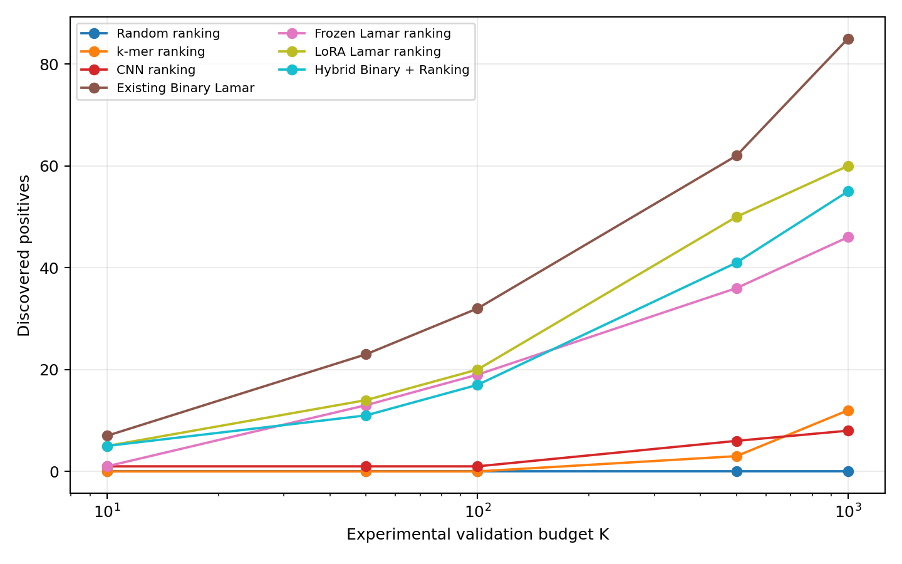

# Lamar Phase 3：sequence-only C-editing candidate prioritization

本目录是 Lamar binary classification 项目的独立 Phase 3 排序研究归档。研究目标不是继续提高 classification AP，而是回答：

> 当实验只能验证 Top 10 / 50 / 100 / 500 / 1000 个候选时，sequence-only Lamar 能否优先找到更多 C-editing candidates？显式 ranking optimization 是否优于已有 Binary Lamar 概率排序？

## 结论

**已有 Binary Lamar 概率是最好的候选排序分数。显式 LoRA ranking、Frozen Lamar ranking 和 Hybrid BCE + ranking 均未超过它。**

Locked test 包含 161 个计算 positive 和 161,000 个 strict negative。所有模型与部署策略在 test 解锁前已基于 dev 和 calibration 冻结。

| Model | Top 10 | Top 50 | Top 100 | Top 500 | Top 1000 | Test AP |
|---|---:|---:|---:|---:|---:|---:|
| Existing Binary Lamar | **7** | **23** | **32** | **62** | **85** | **0.171958** |
| LoRA Lamar ranking | 5 | 14 | 20 | 50 | 60 | 0.092178 |
| Hybrid Binary + Ranking | 5 | 11 | 17 | 41 | 55 | 0.081020 |
| Frozen Lamar ranking | 1 | 13 | 19 | 36 | 46 | 0.060002 |
| CNN ranking | 1 | 1 | 1 | 6 | 8 | 0.005480 |
| k-mer ranking | 0 | 0 | 0 | 3 | 12 | 0.003659 |

Binary Lamar 的关键部署结果：

- Precision@100 = 0.320，Recall@100 = 0.1988，EF@100 = 320.32。
- Precision@500 = 0.124，Recall@500 = 0.3851，EF@500 = 124.12。
- Precision@1000 = 0.085，Recall@1000 = 0.5280，EF@1000 = 85.09。
- 将实验预算从 1000 降到 100 可减少 900 次验证（90%），并保留 Top 1000 中 32/85 = 37.6% 的 positive discoveries。
- 推荐部署为 `Existing Binary Lamar + Platt calibration + deterministic exact Top-K`。
- Platt calibration 的斜率为正，因此 calibration 改变概率解释，但不改变 Top-K 顺序。



## 实验设计

完整设计见 [EXPERIMENT_DESIGN.md](EXPERIMENT_DESIGN.md)，包括：

- 不可变 positive/negative 定义与 train/dev/calibration/test split；
- online dynamic pair sampling；
- 7 类模型、3 类 ranking loss 和 5 类 negative sampling；
- 最多两轮 train-only hard-negative mining；
- dev model selection、calibration-only threshold 和单次 locked-test protocol；
- Precision@K、Recall@K、Enrichment Factor 与 experimental-budget simulation。

## 目录

```text
lamar_ranking_application_phase3/
├── README.md
├── EXPERIMENT_DESIGN.md
├── REPRODUCIBILITY.md
├── ARTIFACT_POLICY.md
├── configs/
│   └── ranking_training_config.yaml
├── results/
├── figures/
├── error_analysis/
├── application/
│   └── budget_simulation.csv
├── scripts/
├── reports/
│   └── final_ranking_report.md
└── provenance/
```

主要结果文件：

- `results/ranking_leaderboard.csv`
- `results/precision_recall_at_k.csv`
- `results/enrichment_results.csv`
- `results/test_ranking_metrics.json`
- `results/final_seed_summary.csv`
- `results/shortcut_bias_analysis.csv`
- `results/threshold_strategy_results.csv`
- `reports/final_ranking_report.md`

## 解释边界

这里的 positive 是冻结 binary dataset 中的 held-out **计算标签**，不是新的独立湿实验真值。因此，本研究证明的是对当前计算标签的候选富集能力；它不能替代 prospective experimental validation，也不能单独证明因果机制、转录本可用性或组织特异性。

完整 checkpoint、全量 prediction parquet、hard-negative parquet 和 161,161 行 ranked-candidate universe 未提交到 GitHub。原因和复现映射见 [ARTIFACT_POLICY.md](ARTIFACT_POLICY.md)。
